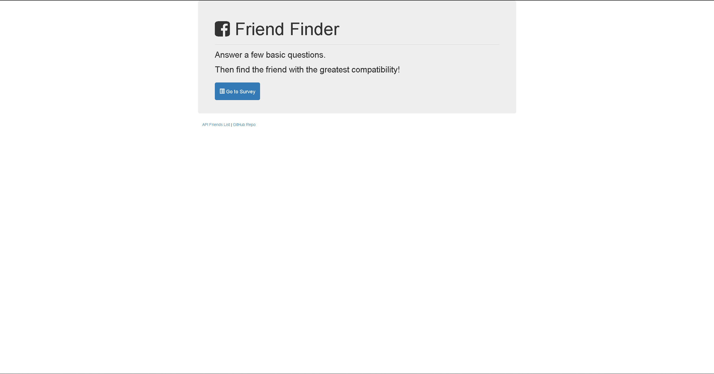

# Find A Friend App
> Simple app showcasing html and api routing to render a best matched friend based upon a short questionaire.

[![NPM Version][npm-image]][npm-url]
[![Build Status][travis-image]][travis-url]
[![Downloads Stats][npm-downloads]][npm-url]

Find A Friend is an app that utilizes html and api routing to render a friend for you based on a short questionaire.  This is done by a pre populated json document that can also be viewed by clicking the api link on the main page.  To use this app you must enter a name and an image.  Answering the questionaire will upload this data to the json document building upon the pre-existing database.

